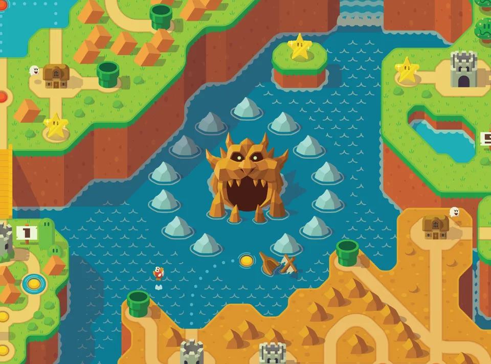
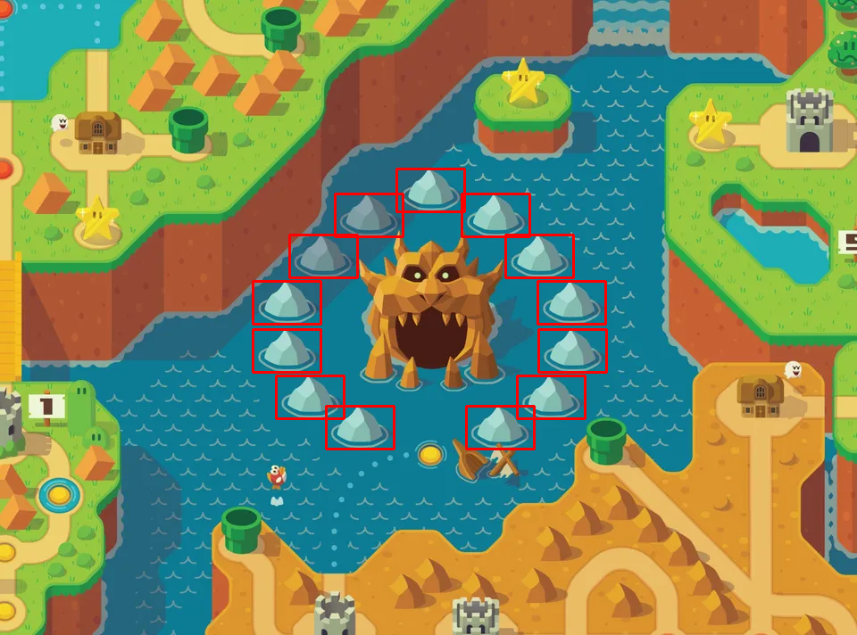

# Template Matching in Rust using OpenCV

This Rust program demonstrates **template matching** using the OpenCV Rust bindings (https://github.com/twistedfall/opencv-rust). Template matching is a technique used in computer vision to find a smaller image (the template) within a larger image.

## How It Works

The program:
- Loads a **source image** and a **template image**.
- Converts the source image to grayscale for easier processing.
- Uses the **normalized cross-correlation method** to find the best match between the template and the source image.
- Draws a red rectangle around the areas in the source image that match the template.
- Repeats this process, covering the matched region, until no more matches are found that exceed a defined threshold.

## Input and Output Images

1. **Source Image**: The larger image where the template will be searched:
   

2. **Template Image**: The smaller image that the program attempts to match within the source:
   

3. **Output Image**: The result of the program, showing the matched template locations outlined in red:
   

## Example Workflow

1. **Input Images**: The program expects two images:
   - `source.png`: The larger image where the template will be searched.
   - `template.png`: The smaller image to be matched.

2. **Template Matching Process**:
   - The program uses OpenCV's `match_template` function with the method `TM_CCOEFF_NORMED`.
   - It then iteratively finds the best match location, draws a red rectangle around it, and repeats the process.

3. **Threshold**: The matching process continues until the match score falls below the predefined threshold of 0.8.

## Installation

### Prerequisites

To run this program, you'll need to have Rust installed on your system. If you haven't installed Rust yet, you can follow the instructions [here](https://www.rust-lang.org/tools/install).

You'll also need to install OpenCV (and bindings for Rust) on your machine, as it is a required dependency for this project. Follow the instructions for your platform [here](https://github.com/twistedfall/opencv-rust/blob/master/INSTALL.md).

### Dependencies

This project relies on the `opencv` crate. In your `Cargo.toml`, make sure you have the following configuration:

```toml
[package]
name = "multi_template_matching"
version = "0.1.0"
edition = "2021"

[dependencies]
opencv = "0.92.2"```

## Contact

- **Author**: Alan Pipitone
- **Email**: alan.pipitone@gmail.com

Please only contact me if you encounter **serious** issues with the code. 

If you're looking to hire someone for **innovative Rust projects**, feel free to reach out — I won't mind! 😄

## Open to Job Opportunities

I am actively seeking **Rust development opportunities**, especially in the fields of systems programming, machine learning, and computer vision. Shoot me an email if you're interested in collaborating on **cool and innovative projects**!
