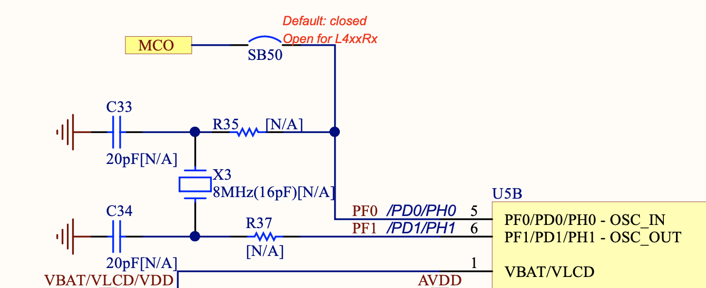

# Firmware Programming with Rust

This project contains firmware written in Rust for the **STM32F303RE** microcontroller, 
featured on the NUCLEO-F303RE development board.  
It leverages the [stm32f3xx-hal](https://github.com/stm32-rs/stm32f3xx-hal) 
hardware abstraction layer.  

Thanks to the broader [stm32-rs project](https://github.com/stm32-rs), 
the code can be easily adapted to other microcontrollers within the STM32 family.

<p align="left">
  
</p>

## How It Works

The program performs the following tasks:

- Configures the hardware peripherals of the STM32F303RE.
- Enables interrupts for both the onboard **button** and **Timer 2**.
- When the **button** is pressed, its interrupt handler is triggered.  
  This toggles the state of the timer: it either enables or disables **Timer 2**.
- If the timer is enabled, it triggers an interrupt every second.
- Each time the timer interrupt occurs, the **LED** on the board is toggled.

All of this behavior is handled using interrupts.  
This was an intentional design choice to test Rust's capabilities in managing 
multiple interrupt sources on a microcontroller.

## Clock Management

According to the board [schematic](https://www.st.com/resource/en/schematic_pack/mb1136-default-c04_schematic.pdf),  
the 8 MHz clock signal is provided by the **ST_LINK** programmer integrated on the board,  
and is fed directly into the **STM32F303RE** microcontroller.

Below, you can see the ST_LINK circuitry.  
On the left is the 8 MHz crystal, and on the right, the MCO output that provides the clock signal to the microcontroller.

For this reason, we configure the clock using `bypass_hse`, which tells the microcontroller 
that the clock signal comes from a signal generator rather than a crystal oscillator.

<p align="left">
  
</p>

Below is part of the STM32F303RE microcontroller circuit.  
On the left, you can see the MCO line from the ST_LINK, which carries the 8 MHz clock signal.

<p align="left">
  
</p>

## Input Handling

The blue button on the board (the black one is the reset) is connected to pin **PC13**  
and already includes an external pull-up resistor.  
Therefore, we do not need to enable the internal pull-up in the firmware.  
We simply configure it using `into_floating_input`.

<p align="left">
  
</p>

Note that the interrupt for pin PC13 is managed by the **EXTI13** register  
(see page 258 of the [reference manual](https://www.st.com/resource/en/reference_manual/dm00043574.pdf)).  
You can enable an exclusive interrupt for PA13, PB13, PC13, PD13, PE13, PF13, or PG13.  
If you enable the interrupt for PC13, you cannot enable it simultaneously for PA13 or PB13, etc.  

However, since the board only uses PC13, this is not an issue.

<p align="left">
  
</p>
<p align="left">
  
</p>

Note that EXTI lines 10 through 15 (including EXTI13) share a single interrupt: **EXTI15_10**.  
In the code, we must check the interrupt source to confirm it's from EXTI13,  
not from another line like EXTI11.

## LED Handling

From the schematic, we can see that the green LED is connected to pin **PA5**.

<p align="left">
  
</p>

## Installation

### Prerequisites

To run this program, you'll need to have Rust installed.  
If you haven’t installed Rust yet, follow the instructions [here](https://www.rust-lang.org/tools/install).

You’ll also need to install [probe-rs](https://probe.rs/docs/getting-started/installation/) on your system.

If you're using Visual Studio Code (like I did),  
install the [probe-rs-debugger](https://marketplace.visualstudio.com/items?itemName=probe-rs.probe-rs-debugger) plugin  
to debug the firmware.

In addition to probe-rs-debugger (which is specific to embedded debugging),  
I also installed other useful VS Code plugins:  
**rust-analyzer**, **crates** (now deprecated), and **CodeLLDB**.

Both `launch.json` and `tasks.json` are configured  
to allow building and debugging the firmware,  
setting breakpoints, and viewing debug output.

<p align="left">
  
</p>

<p align="left">
  
</p>

### Dependencies

This project relies on the `stm32f3xx-hal` crate.  
In your `Cargo.toml`, make sure you include the following:

```toml
[package]
name = "stm32f303re"
version = "0.1.0"
edition = "2021"

[dependencies]
cortex-m = { version = "0.7.6", features = ["critical-section-single-core"]}
cortex-m-rt = { version = "0.7.3", features = ["device"] }

panic-halt = "1.0.0"

stm32f3xx-hal = { version = "0.10.0", features = ["ld", "rt", "stm32f303xe"] }
critical-section = "1.0"
panic-semihosting = "0.6.0"

defmt = { version = "1.0.1" }
rtt-target = { version = "0.6", features = ["defmt"] }
```

## Contact

- **Author**: Alan Pipitone
- **Email**: alan.pipitone@gmail.com

Please only contact me if you encounter **serious** issues with the code. 

If you're looking to hire someone for **innovative Rust projects**, feel free to reach out — I won't mind! 😄

## Open to Job Opportunities

I am actively seeking **Rust development opportunities**, especially in the fields of systems programming, machine learning, and computer vision. Shoot me an email if you're interested in collaborating on **cool and innovative projects**!